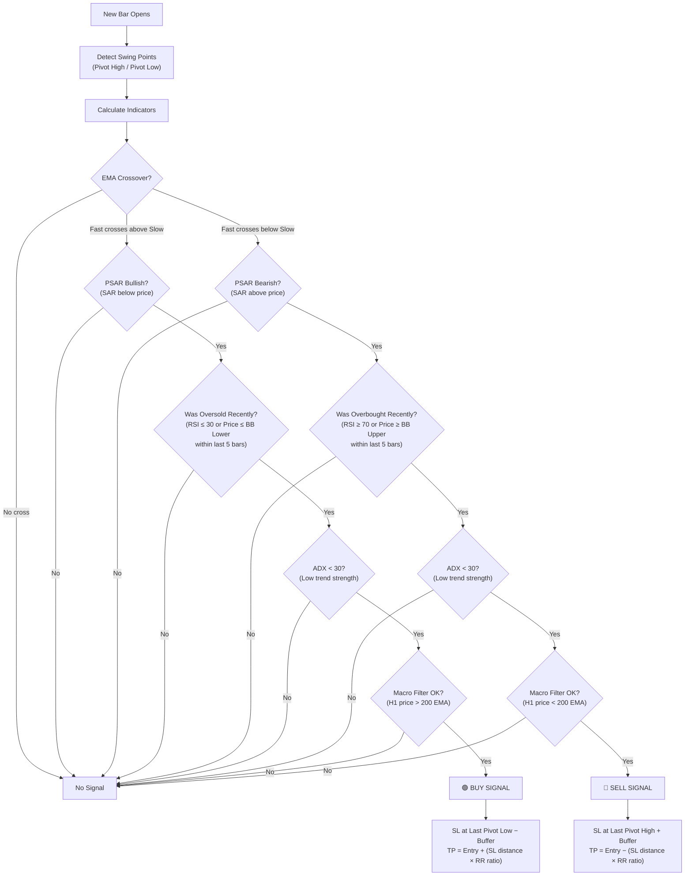
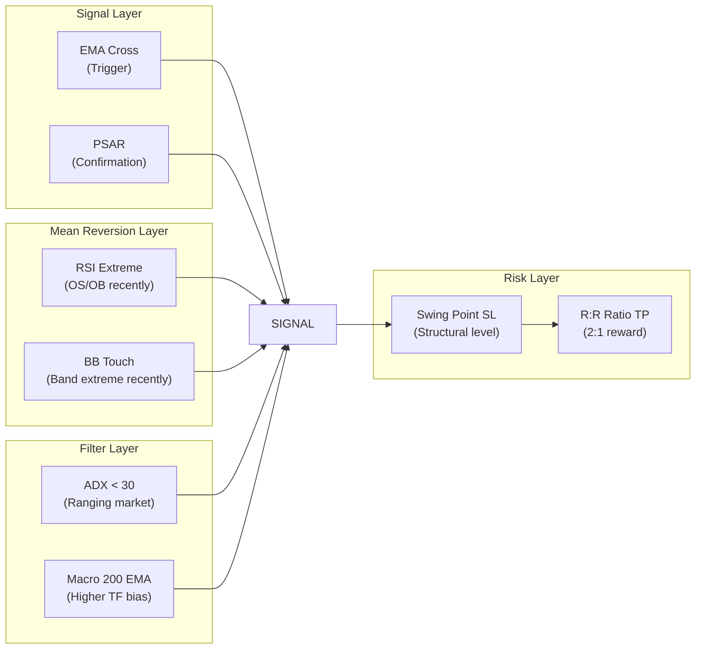

# Combined HL-EPR Mean Reversion Sniper EA v2.0 — Complete Strategy Analysis

## Strategy Identity

**Name:** Combined HL-EPR Mean Reversion Sniper EA  
**Version:** 2.0 (converted from PineScript)  
**Core Philosophy:** **Mean Reversion** — the EA bets that price will snap back toward its average after stretching to an extreme, but only when multiple independent indicators align to confirm the reversal.

---

## Architecture Overview



---

## The 6 Indicators Used

| # | Indicator | Default Parameters | Role in the Strategy |
|---|-----------|-------------------|---------------------|
| 1 | **Pivot Points (High/Low)** | Left=10, Right=10 bars | Identifies structural swing highs and lows for stop-loss placement |
| 2 | **EMA Crossover** | Fast=5, Slow=15 | Primary entry **trigger** — detects momentum shift |
| 3 | **Parabolic SAR** | Start=0.02, Inc=0.02, Max=0.20 | **Directional confirmation** — must agree with trade direction |
| 4 | **RSI** | Period=7, OB=70, OS=30 | **Mean reversion qualifier** — price must have been at an extreme recently |
| 5 | **Bollinger Bands** | Period=20, StdDev=2.0 | **Mean reversion qualifier** — alternative extreme detection (price touching bands) |
| 6 | **ADX** | Period=14, Threshold=30 | **Regime filter** — blocks trades in strong trends (mean reversion only works in ranging markets) |
| 7 | **Macro EMA** | H1 timeframe, Period=200 | **Higher-timeframe bias** — ensures trades align with the larger trend direction |

---

## Signal Generation — Step by Step

### Step 1: New Bar Detection (Line 395–398)

The EA only processes logic **once per new bar** (bar-close logic). This prevents multiple signals within the same candle and mirrors PineScript's bar-close behavior.

```mq5
static datetime lastBar = 0;
datetime currentBar = iTime(_Symbol, PERIOD_CURRENT, 0);
if(currentBar == lastBar) return;
lastBar = currentBar;
```

---

### Step 2: Swing Point Detection (Lines 292–457)

The EA scans for **confirmed pivot points** — structural swing highs and lows.

#### How Pivot Detection Works

A **Pivot High** at bar index `offset` is confirmed when:
- The high at `offset` is **strictly higher** than all highs for `leftLen` bars to its left
- The high at `offset` is **strictly higher** than all highs for `rightLen` bars to its right

```mq5
bool IsPivotHigh(const double &highs[], int offset, int leftLen, int rightLen)
{
   double candidate = highs[offset];
   for(int i = 1; i <= leftLen; i++)
      if(highs[offset + i] >= candidate) return false;   // any left bar ≥ candidate → not a pivot
   for(int i = 1; i <= rightLen; i++)
      if(highs[offset - i] >= candidate) return false;   // any right bar ≥ candidate → not a pivot
   return true;
}
```

A **Pivot Low** uses the mirror logic (candidate must be strictly **lower** than all surrounding bars).

#### Confirmation Delay

The pivot is checked at bar index `rightLen` (default=10), meaning a pivot high/low is only **confirmed** after 10 bars have formed to its right. This introduces a **10-bar lag** but eliminates false pivots.

#### Storage

Once confirmed, the pivot price and timestamp are stored in global variables:
- `g_lastPivotHigh` / `g_lastPivotHighTime`
- `g_lastPivotLow` / `g_lastPivotLowTime`

These are used later for **stop-loss placement**.

#### Visual Labels

Each new pivot is drawn on the chart with:
- A **down-arrow (Wingdings 234)** above pivot highs in red
- An **up-arrow (Wingdings 233)** below pivot lows in lime green
- A price label showing the exact pivot price

Old labels are pruned when they exceed `InpMaxSwingLabels` (default 100).

---

### Step 3: EMA Crossover — The Entry Trigger (Lines 459–468)

The EA uses two EMAs on the current timeframe:
- **Fast EMA** (period 5) — responsive to recent price
- **Slow EMA** (period 15) — smoother baseline

It checks bars `[1]` (last completed bar) and `[2]` (bar before that) for a crossover:

```mq5
bool crossOver  = (emaFast2 <= emaSlow2) && (emaFast1 > emaSlow1);  // Bullish cross
bool crossUnder = (emaFast2 >= emaSlow2) && (emaFast1 < emaSlow1);  // Bearish cross
```

| Condition | Meaning |
|-----------|---------|
| `crossOver` | Fast EMA was ≤ Slow EMA, now Fast > Slow → **Bullish momentum shift** |
| `crossUnder` | Fast EMA was ≥ Slow EMA, now Fast < Slow → **Bearish momentum shift** |

> [!IMPORTANT]
> The EMA crossover is the **primary trigger**. Without it, no signal fires — all other indicators are **filters** that must also pass.

---

### Step 4: Parabolic SAR Confirmation (Lines 470–475)

The Parabolic SAR (Stop and Reverse) provides directional confirmation:

```mq5
double sar1    = sarArr[1];              // SAR value on last completed bar
bool psarBull  = (sar1 < closeArr[1]);   // SAR below price = bullish
bool psarBear  = (sar1 > closeArr[1]);   // SAR above price = bearish
```

| Condition | Meaning |
|-----------|---------|
| `psarBull` | SAR dots are **below** price → uptrend confirmed |
| `psarBear` | SAR dots are **above** price → downtrend confirmed |

This filter prevents buying during a SAR-indicated downtrend or selling during a SAR-indicated uptrend.

---

### Step 5: Mean Reversion Extreme Check (Lines 477–491)

This is the **core mean-reversion logic**. The EA checks whether price was at an **extreme** within the last `InpExtLookback` bars (default: 5 bars).

The EA scans bars `[1]` through `[5]` looking for **either** of two conditions:

#### For a BUY (oversold extreme — `wasExtOS`):
```mq5
if((lowArr[k] <= bbLowerArr[k]) || (rsiArr[k] <= InpRsiOS)) wasExtOS = true;
```
- **Price touched or pierced the lower Bollinger Band**, OR
- **RSI dropped to ≤ 30** (oversold)

#### For a SELL (overbought extreme — `wasExtOB`):
```mq5
if((highArr[k] >= bbUpperArr[k]) || (rsiArr[k] >= InpRsiOB)) wasExtOB = true;
```
- **Price touched or pierced the upper Bollinger Band**, OR
- **RSI rose to ≥ 70** (overbought)

> [!NOTE]
> **The extreme doesn't need to be happening right now** — it just needs to have happened within the lookback window. The idea is: price stretched to an extreme → now the EMA cross signals it's snapping back → that's the entry.

---

### Step 6: ADX Regime Filter (Lines 493–497)

The ADX (Average Directional Index) measures **trend strength** regardless of direction.

```mq5
double adxVal = adxArr[1];
bool adxOk    = !InpUseAdx || (adxVal < InpAdxThreshold);  // Default threshold = 30
```

| ADX Value | Market Regime | Trade? |
|-----------|--------------|--------|
| < 20 | Weak/No trend | ✅ Ideal for mean reversion |
| 20–30 | Moderate trend | ✅ Still acceptable |
| > 30 | Strong trend | ❌ **Blocked** — mean reversion is dangerous in strong trends |

This is a critical filter: mean reversion strategies fail in trending markets. The ADX filter prevents the EA from fading a strong move.

---

### Step 7: Macro Timeframe Filter (Lines 499–510)

The EA checks a **higher timeframe** (default: H1) using a 200-period EMA to determine the larger market bias:

```mq5
bool macroOkBull = !InpUseMacro || (macroPrice1 > macroEma1);  // H1 price above 200 EMA
bool macroOkBear = !InpUseMacro || (macroPrice1 < macroEma1);  // H1 price below 200 EMA
```

| Macro Condition | Allowed Trades |
|----------------|----------------|
| H1 price **above** H1 200-EMA | Only **BUY** signals allowed |
| H1 price **below** H1 200-EMA | Only **SELL** signals allowed |

This prevents taking mean-reversion buy signals in a macro downtrend (and vice versa).

> [!NOTE]
> There is a subtle issue here: the macro price uses `macroPriceArr[0]` (current bar, index 0) while the macro EMA uses `macroEmaArr[1]` (previous bar, index 1). This means the macro close is the current H1 bar's close (which may still be forming), compared against the previous bar's EMA. This is likely intentional to get the freshest directional read, but it means the macro filter uses an unconfirmed bar.

---

### Step 8: Final Signal Assembly (Lines 512–514)

All conditions are combined with **logical AND**:

```mq5
bool buySig  = crossOver  && psarBull && wasExtOS && adxOk && macroOkBull;
bool sellSig = crossUnder && psarBear && wasExtOB && adxOk && macroOkBear;
```

#### BUY Signal Requires ALL of:
1. ✅ EMA 5 crossed **above** EMA 15 (bullish momentum shift)
2. ✅ Parabolic SAR is **below** price (bullish direction)
3. ✅ Within the last 5 bars, price was **oversold** (RSI ≤ 30 OR price ≤ lower Bollinger Band)
4. ✅ ADX is **below 30** (no strong trend — safe for mean reversion)
5. ✅ H1 close is **above** the H1 200-EMA (macro bullish bias)

#### SELL Signal Requires ALL of:
1. ✅ EMA 5 crossed **below** EMA 15 (bearish momentum shift)
2. ✅ Parabolic SAR is **above** price (bearish direction)
3. ✅ Within the last 5 bars, price was **overbought** (RSI ≥ 70 OR price ≥ upper Bollinger Band)
4. ✅ ADX is **below 30** (no strong trend — safe for mean reversion)
5. ✅ H1 close is **below** the H1 200-EMA (macro bearish bias)

---

## Trade Execution & Risk Management

### Position Filtering (Lines 316–328)

Before opening a trade, the EA checks `HasOpenPosition()` to ensure **only one position per direction** is active at a time. It filters by symbol and magic number.

```mq5
if(buySig  && !HasOpenPosition(POSITION_TYPE_BUY))   // Only 1 buy allowed
if(sellSig && !HasOpenPosition(POSITION_TYPE_SELL))   // Only 1 sell allowed
```

> [!WARNING]
> The EA **can** hold a BUY and a SELL simultaneously (hedging). It only prevents multiple positions in the **same direction**.

---

### Stop Loss Calculation

The EA offers two SL modes:

#### Mode 1: Swing Point Stop Loss (Default — `InpUseSwingPointSL = true`)

| Trade | Stop Loss Placement |
|-------|-------------------|
| **BUY** | `SL = Last Pivot Low − Buffer Pips` (default buffer = 5 pips) |
| **SELL** | `SL = Last Pivot High + Buffer Pips` (default buffer = 5 pips) |

The logic places the SL just beyond the last structural swing point — a natural support/resistance level. The buffer (default 5 pips) adds safety margin to avoid stop-hunting.

**Safety fallback:** If the swing SL is on the wrong side of entry (e.g., the last pivot low is actually above the current ask price — stale data), the EA logs a warning and falls back to fixed-pip SL.

#### Mode 2: Fixed Pip Stop Loss (`InpUseSwingPointSL = false`)

| Trade | Stop Loss |
|-------|-----------|
| **BUY** | `SL = Entry − 50 pips` |
| **SELL** | `SL = Entry + 50 pips` |

---

### Take Profit Calculation (Lines 379–388)

TP is calculated as a **multiple of the SL distance**, using the Risk:Reward ratio (default 1:2):

```mq5
double slDistance = MathAbs(entryPrice - slPrice);
double tpDistance = slDistance * InpRiskRewardRatio;   // 2.0x by default
```

| Trade | Take Profit |
|-------|------------|
| **BUY** | `TP = Entry + (SL distance × 2.0)` |
| **SELL** | `TP = Entry − (SL distance × 2.0)` |

**Example:** If a BUY entry is at 1.1000 and swing SL is at 1.0950 (50 pips risk), then TP = 1.1000 + (50 × 2) = 1.1100 (100 pips reward).

---

## Summary: What Makes This Strategy Unique



### The Core Thesis in Plain English

> **"Price has just bounced off an extreme (it was oversold/overbought recently). Now the fast EMA has crossed the slow EMA — confirming the bounce is real. The PSAR agrees. We're not in a strong trend (ADX is low), so mean reversion is viable. And the macro trend on H1 supports this direction. Enter the trade, place the stop behind the last swing structure, and target 2× the risk."**

### Key Design Characteristics

| Aspect | Detail |
|--------|--------|
| **Strategy Type** | Mean Reversion with Momentum Confirmation |
| **Execution Frequency** | Once per bar (bar-close logic) |
| **Max Concurrent Trades** | 2 (one BUY + one SELL) |
| **Signal Rarity** | Very selective — 5 conditions must align simultaneously |
| **SL Method** | Structural (swing points) with fixed fallback |
| **TP Method** | Risk-multiple based (not fixed target) |
| **Lot Sizing** | Fixed lot (no risk % or position sizing) |
| **No Exit Logic** | No trailing stop, no breakeven — relies entirely on SL/TP |
| **No Time Filter** | No session filter — trades 24/5 |
| **No Spread Filter** | No spread check before entry |
